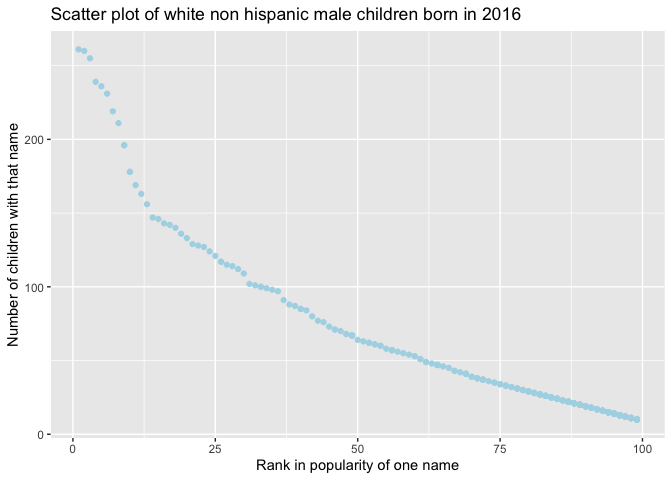

p8105\_hw2\_TZ2472
================
tianwei zhao
10/5/2021

## problem 1

Read and clean the Mr. Trash Wheel sheet:

specify the sheet in the Excel file and to omit non-data entries (rows
with notes / figures; columns containing notes) using arguments in
read\_excel

use reasonable variable names

omit rows that do not include dumpster-specific data

round the number of sports balls to the nearest integer

``` r
trawheel_df = 
  read_excel("data/Trash-Wheel-Collection-Totals-7-2020-2.xlsx",range = "A2:N535") %>% 
  janitor::clean_names() %>% 
  relocate(sports_balls) %>% 
  mutate(sports_balls = round(sports_balls)) %>% 
  drop_na(dumpster)
```

Read and clean precipitation data for 2018 and 2019. For each, omit rows
without precipitation data and add a variable for year.

``` r
precip2018_df = 
  read_excel("data/Trash-Wheel-Collection-Totals-7-2020-2.xlsx",
             sheet = 7 ,range ="A2:B15" ) %>% 
  janitor::clean_names() %>% 
  drop_na() %>% 
  mutate(year = "2018")

precip2019_df =
    read_excel("data/Trash-Wheel-Collection-Totals-7-2020-2.xlsx",
             sheet = 6, range = "A2:B15") %>% 
  janitor::clean_names() %>% 
  drop_na() %>% 
  mutate(year = "2019")
```

Next, combine precipitation datasets and convert month to a character
variable (the variable month.name is built into R and should be useful).

``` r
precip1819_df = 
  bind_rows(precip2018_df,precip2019_df) %>% 
  janitor::clean_names() %>% 
  relocate(year) %>% 
  mutate(month = month.name[month]) %>% 
  rename(precipitation = total) #change the variable name total to precipitation for better understanding 
```

Write a paragraph about these data; you are encouraged to use inline R.
Be sure to note the number of observations in both resulting datasets,
and give examples of key variables. For available data, what was the
total precipitation in 2018? What was the median number of sports balls
in a dumpster in 2019?

In the Mr.Trash wheel data set, we have a total of 454 observations,
each represents a dumpster.The data has 14 variables, collects key
information about Mr.Trash Weel such as specific dumpster number, date,
amount of trash they collected in weight and volumes, types of trash
such as bottles, polystyrene, cigarette and bags, and the homes they
powered. The median number of sports balls in a dumpster in 2019 is 9.

In the precipitation in 2018 data set, we we have a total of 12
observations, and 3 variables,which lists out month and precipitation in
that month.

In the precipitation in 2019 data set, we we have a total of 12
observations, and 3 variables,which lists out month and precipitation in
that month.

In the combined data set, we have 24observations, and 3 variables
listing out the month with precipitations in both 2018 and 2019,and also
the total amount of precipitation in each month and year. The total
precipitation in 2018 is 70.33.

## Problem 2

First, clean the data in pols-month.csv. Use separate() to break up the
variable mon into integer variables year, month, and day; replace month
number with month name; create a president variable taking values gop
and dem, and remove prez\_dem and prez\_gop; and remove the day
variable.

``` r
pols_df = read_csv("data/fivethirtyeight_datasets/pols-month.csv") %>% 
  janitor::clean_names() %>% 
  separate("mon",c("year","month","day") ) %>% #break up the variable mon into integer variables year, month, and day
  mutate(month =month.name[as.numeric(month)]) %>% # replace month number with month name
  mutate(president = case_when(
    prez_gop >= 1 ~ "gop",
    prez_dem == 1 ~ "dem")) %>% #create a president variable taking values gop and dem
  select(-c(day,prez_dem,prez_gop))#remove prez_dem and prez_gop; and remove the day variable
```

    ## Rows: 822 Columns: 9

    ## ── Column specification ────────────────────────────────────────────────────────
    ## Delimiter: ","
    ## dbl  (8): prez_gop, gov_gop, sen_gop, rep_gop, prez_dem, gov_dem, sen_dem, r...
    ## date (1): mon

    ## 
    ## ℹ Use `spec()` to retrieve the full column specification for this data.
    ## ℹ Specify the column types or set `show_col_types = FALSE` to quiet this message.

Second, clean the data in snp.csv using a similar process to the above.
For consistency across datasets, arrange according to year and month,
and organize so that year and month are the leading columns.

``` r
snp_df = read_csv("data/fivethirtyeight_datasets/snp.csv") %>% 
  mutate(date = lubridate::mdy(date)) %>% 
  separate("date",c("year","month","day") ) %>%  
  mutate(year = as.numeric(year),
         month = as.numeric(month),
         year = ifelse(year >2015, year-100,year)) %>% 
  arrange(year,month) %>% 
  mutate (month = month.name[month],
          year = as.character(year))%>% 
  relocate(year,month) # clean the data in snp.csv using a similar process to the above
```

    ## Rows: 787 Columns: 2

    ## ── Column specification ────────────────────────────────────────────────────────
    ## Delimiter: ","
    ## chr (1): date
    ## dbl (1): close

    ## 
    ## ℹ Use `spec()` to retrieve the full column specification for this data.
    ## ℹ Specify the column types or set `show_col_types = FALSE` to quiet this message.

Third, tidy the unemployment data so that it can be merged with the
previous datasets. This process will involve switching from “wide” to
“long” format; ensuring that key variables have the same name; and
ensuring that key variables take the same values.

``` r
unemploy_df = read_csv("data/fivethirtyeight_datasets/unemployment.csv",
                       col_names = c("year","1":"12"),skip = 1) %>% #rewrite the month to numbers
  pivot_longer( "1":"12",names_to = "month") %>% #arrange months into one colunm which named "month"
  mutate(month = month.name[as.numeric(month)],
         year = as.character(year)) #replace month number with month name
```

    ## Rows: 68 Columns: 13

    ## ── Column specification ────────────────────────────────────────────────────────
    ## Delimiter: ","
    ## dbl (13): year, 1, 2, 3, 4, 5, 6, 7, 8, 9, 10, 11, 12

    ## 
    ## ℹ Use `spec()` to retrieve the full column specification for this data.
    ## ℹ Specify the column types or set `show_col_types = FALSE` to quiet this message.

Join the datasets by merging snp into pols, and merging unemployment
into the result.

``` r
combined_df = 
  left_join(pols_df, snp_df,by = c("year","month")) %>% 
  left_join(unemploy_df, by = c("year","month"))
```

Write a short paragraph about these datasets. Explain briefly what each
dataset contained, and describe the resulting dataset (e.g. give the
dimension, range of years, and names of key variables).

pols\_df is a 822\*9 data frame, which has a range of 68 years, and has
variables of year, month,president of either republic or democratic
sides,the number of governors, senators, representatives of either
republic or democratic sides on the associated date.

snp\_df is a 787\*4 data frame, that has a range of 65 years, and has
variables of year, month, date, and the closing values of the S&P stock
index on the associated date.

unemploy\_df is a 816\*3 data frame, that has a range of 67 years, and
has varibale of year, month, percentage of unemployment in each month of
the associated year.

combined\_df is a 822\*12 data frame, that has a range of 68 years, and
has varibale of year, month,president of either republic or democratic
sides,the number of governors, senators, representatives of either
republic or democratic sides on the associated date,the closing values
of the S&P stock index on the associated date,and percentage of
unemployment in each month of the associated year.

## Problem 3

Load and tidy the data. Note that, although these data may seem fairly
well formatted initially, the names of a categorical predictor and the
case structure of string variables changed over time; you’ll need to
address this in your data cleaning. Also, some rows seem duplicated, and
these will need to be removed (hint: google something like “dplyr remove
duplicate rows” to get started).

``` r
popular_df = read_csv("data/Popular_Baby_Names.csv") %>% 
  janitor::clean_names() %>% 
  mutate(childs_first_name = str_to_lower(childs_first_name),
         gender = str_to_lower(gender),
         ethnicity = str_to_lower(ethnicity)) %>% 
  # make each level ethnicity identical
  mutate(ethnicity = replace(ethnicity, ethnicity == 'asian and paci', 'asian and pacific islander'),
         ethnicity = replace(ethnicity, ethnicity == 'black non hisp', 'black non hispanic'),
         ethnicity = replace(ethnicity, ethnicity == 'white non hisp', 'white non hispanic')) %>% 
  distinct() #remove duplicate rows.
```

    ## Rows: 19418 Columns: 6

    ## ── Column specification ────────────────────────────────────────────────────────
    ## Delimiter: ","
    ## chr (3): Gender, Ethnicity, Child's First Name
    ## dbl (3): Year of Birth, Count, Rank

    ## 
    ## ℹ Use `spec()` to retrieve the full column specification for this data.
    ## ℹ Specify the column types or set `show_col_types = FALSE` to quiet this message.

``` r
popular_df     
```

    ## # A tibble: 12,181 × 6
    ##    year_of_birth gender ethnicity                  childs_first_name count  rank
    ##            <dbl> <chr>  <chr>                      <chr>             <dbl> <dbl>
    ##  1          2016 female asian and pacific islander olivia              172     1
    ##  2          2016 female asian and pacific islander chloe               112     2
    ##  3          2016 female asian and pacific islander sophia              104     3
    ##  4          2016 female asian and pacific islander emily                99     4
    ##  5          2016 female asian and pacific islander emma                 99     4
    ##  6          2016 female asian and pacific islander mia                  79     5
    ##  7          2016 female asian and pacific islander charlotte            59     6
    ##  8          2016 female asian and pacific islander sarah                57     7
    ##  9          2016 female asian and pacific islander isabella             56     8
    ## 10          2016 female asian and pacific islander hannah               56     8
    ## # … with 12,171 more rows

Produce a well-structured, reader-friendly table showing the rank in
popularity of the name “Olivia” as a female baby name over time; this
should have rows for ethnicities and columns for year. Produce a similar
table showing the most popular name among male children over time.

``` r
olivia_female_df = popular_df %>% 
  filter(childs_first_name == 'olivia', gender=='female') %>% 
  select(!c(childs_first_name,gender, count)) %>% 
  pivot_wider(
    names_from = "year_of_birth",
    values_from = "rank")
knitr::kable(olivia_female_df, caption = "Rank of the Popularity of Olivia")
```

| ethnicity                  | 2016 | 2015 | 2014 | 2013 | 2012 | 2011 |
|:---------------------------|-----:|-----:|-----:|-----:|-----:|-----:|
| asian and pacific islander |    1 |    1 |    1 |    3 |    3 |    4 |
| black non hispanic         |    8 |    4 |    8 |    6 |    8 |   10 |
| hispanic                   |   13 |   16 |   16 |   22 |   22 |   18 |
| white non hispanic         |    1 |    1 |    1 |    1 |    4 |    2 |

Rank of the Popularity of Olivia

``` r
most_popular_male_df = popular_df %>% 
  filter(gender == 'male',rank == 1) %>% 
  select(!c(childs_first_name,count)) %>% 
  pivot_wider(names_from = "year_of_birth",
              values_from = "rank")
knitr::kable(most_popular_male_df, caption = "Rank of the Popularity of Male")
```

| gender | ethnicity                  | 2016 | 2015 | 2014 | 2013 | 2012 | 2011 |
|:-------|:---------------------------|-----:|-----:|-----:|-----:|-----:|-----:|
| male   | asian and pacific islander |    1 |    1 |    1 |    1 |    1 |    1 |
| male   | black non hispanic         |    1 |    1 |    1 |    1 |    1 |    1 |
| male   | hispanic                   |    1 |    1 |    1 |    1 |    1 |    1 |
| male   | white non hispanic         |    1 |    1 |    1 |    1 |    1 |    1 |

Rank of the Popularity of Male

Finally, for male, white non-hispanic children born in 2016, produce a
scatter plot showing the number of children with a name (y axis) against
the rank in popularity of that name (x axis).

``` r
scatterplot_df = popular_df %>% 
  filter(gender == 'male', ethnicity == 'white non hispanic', year_of_birth == 2016)

ggplot(scatterplot_df, aes(x=rank, y=count)) +
  geom_point(color = 'lightblue') + 
  ggtitle("Scatter plot of white non hispanic male children born in 2016") +
  ylab("Number of children with that name") + 
  xlab("Rank in popularity of one name")
```

<!-- -->
